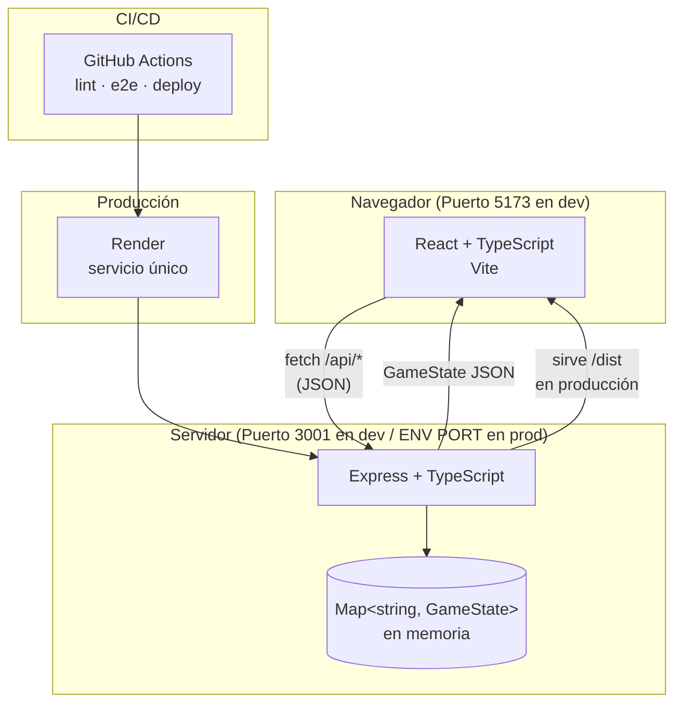
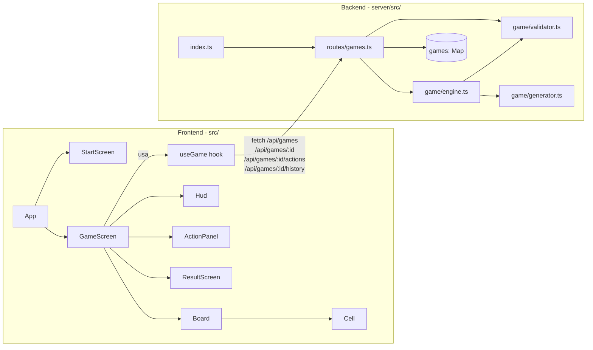
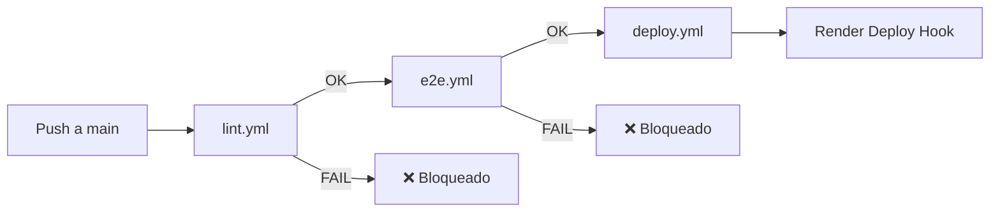

# Design Document

## Overview

**Duelo de Cristales** es un juego web por turnos para 2 jugadores en el mismo dispositivo. El sistema se divide en dos capas con responsabilidades bien definidas: un **Backend** autoritativo (Express + TypeScript) que valida y resuelve toda la lógica de juego, y un **Frontend** reactivo (React + TypeScript + Vite) que renderiza el estado y envía las acciones del usuario.

El flujo de datos es unidireccional:

```
Acción del usuario → React → fetch → Express → lógica del juego → JSON → React renderiza estado
```

No existe base de datos persistente: el estado de cada partida vive en un `Map` en memoria del proceso de Node.js. Esto simplifica el despliegue en Render (single-service) y es adecuado para el alcance del proyecto.

---

## Architecture

### Arquitectura de Alto Nivel



En **desarrollo**, Vite actúa como proxy para las rutas `/api/*` hacia `http://localhost:3001`, permitiendo que el frontend use rutas relativas sin problemas de CORS. En **producción**, Express sirve el build estático del frontend y gestiona las rutas de la API en el mismo proceso, por lo que no es necesaria ninguna configuración de CORS ni dominio adicional.

### Arquitectura de Bajo Nivel



### Estructura de Carpetas

```
duelo-de-cristales/
├── client/
│   ├── src/
│   │   ├── components/
│   │   │   ├── Board.tsx
│   │   │   ├── Cell.tsx
│   │   │   ├── Hud.tsx
│   │   │   ├── ActionPanel.tsx
│   │   │   ├── StartScreen.tsx
│   │   │   └── ResultScreen.tsx
│   │   ├── hooks/
│   │   │   └── useGame.ts
│   │   ├── types/
│   │   │   └── game.ts
│   │   ├── App.tsx
│   │   ├── main.tsx
│   │   └── styles.css
│   ├── index.html
│   ├── package.json
│   ├── tsconfig.json
│   └── vite.config.ts
├── server/
│   ├── src/
│   │   ├── game/
│   │   │   ├── engine.ts
│   │   │   ├── generator.ts
│   │   │   ├── validator.ts
│   │   │   └── types.ts
│   │   ├── routes/
│   │   │   └── games.ts
│   │   └── index.ts
│   ├── package.json
│   └── tsconfig.json
├── tests/
│   └── e2e/
│       └── game.spec.ts
├── docs/
│   ├── introduction.md
│   ├── reglas.md
│   ├── api.md
│   ├── decisiones.md
│   ├── investigacion.md
│   └── ia.md
├── .github/
│   └── workflows/
│       ├── lint.yml
│       ├── e2e.yml
│       └── deploy.yml
├── playwright.config.ts
├── package.json
└── README.md
```

---

## Components and Interfaces

### Frontend

#### `StartScreen`
Formulario de inicio de partida. Contiene dos campos de texto (`<input>`) para los nombres de P1 y P2 y un botón para iniciar. Valida localmente (sin fetch) que ambos campos tengan entre 1 y 30 caracteres no vacíos antes de enviar la solicitud. Muestra mensajes de validación en caso de error.

**Props:** `onGameCreated: (gameId: string, initialState: GameState) => void`

#### `Board`
Cuadrícula 10×10 que ocupa al menos el 80 % del área visible. Renderiza 100 componentes `Cell` en orden `board[y][x]`. Aplica transiciones CSS (100–400 ms) a los proyectiles y minions para animar su movimiento.

**Props:** `state: GameState`

#### `Cell`
Renderiza el contenido de una casilla: obstáculo, cristal, mago (P1/P2), minion (P1/P2), núcleo (P1/P2), proyectil o vacío. Usa colores e iconos diferenciados por tipo y jugador propietario.

**Props:** `cell: Cell; units: Unit[]; projectiles: Projectile[]; x: number; y: number`

#### `Hud`
Interfaz permanente y no colapsable. Muestra: HP del Núcleo de cada jugador, maná de cada jugador, cristales de cada jugador y `turnNumber` actual.

**Props:** `state: GameState`

#### `ActionPanel`
Panel con 6 botones de acción: Mover, Recolectar, Invocar, Hechizo, Atacar y Defender. Los botones del jugador inactivo tienen el atributo `disabled`. Muestra el mensaje de error del Backend durante al menos 3 segundos.

**Props:** `state: GameState; activePlayer: PlayerId; onAction: (req: ActionRequest) => void; error: string | null`

#### `ResultScreen`
Pantalla de resultado cuando `status === "finished"`. Muestra el ganador o el empate y un botón para volver a la pantalla de inicio.

**Props:** `winner: PlayerId | 'draw'; onRestart: () => void`

#### `useGame` (hook)
Centraliza todo el estado del juego y las llamadas a la API. Expone:

```typescript
interface UseGame {
  gameId: string | null;
  state: GameState | null;
  error: string | null;
  loading: boolean;
  createGame: (player1: string, player2: string) => Promise<void>;
  fetchState: () => Promise<void>;
  sendAction: (req: ActionRequest) => Promise<void>;
}
```

Usa exclusivamente `fetch` nativo. En caso de error HTTP (4xx/5xx), guarda el mensaje en `error` y mantiene el último `state` válido sin interrumpir el flujo de la aplicación.

---

### Backend

#### `generator.ts`
Responsable de construir el estado inicial de una partida. Genera el tablero 10×10 con posicionamiento determinista de Núcleos y Magos, y posicionamiento aleatorio de obstáculos, cristales y eventos ocultos. Garantiza que no haya colisiones entre elementos.

**Interfaz pública:**
```typescript
function createInitialState(player1: string, player2: string): GameState
```

**Algoritmo de generación del tablero:**
1. Marcar como reservadas las posiciones de Núcleos `(0,0)`, `(9,9)` y Magos `(0,1)`, `(9,8)`.
2. Obtener lista de casillas libres (100 − 4 = 96 disponibles).
3. Seleccionar aleatoriamente (Fisher-Yates) 8 posiciones para obstáculos.
4. De las restantes, seleccionar 4 para cristales.
5. De las restantes, seleccionar 2 para eventos ocultos.

#### `validator.ts`
Valida cada acción antes de que el motor la aplique. Devuelve `{ valid: true }` o `{ valid: false, error: string }`.

**Interfaz pública:**
```typescript
function validateAction(state: GameState, req: ActionRequest): ValidationResult
```

**Validaciones que realiza:**
- `status !== 'finished'` → partida activa
- `req.playerId === state.turn` → turno correcto
- Maná suficiente para la acción solicitada
- Límites del tablero (0–9) para movimiento y hechizo
- Casilla destino no bloqueada por obstáculo o unidad para movimiento
- Existencia de cristal en casilla del mago para `collect`
- Casilla adyacente libre para `summon`
- Dirección válida para `move` y `spell`

#### `engine.ts`
Aplica la acción validada y resuelve los efectos secundarios del turno. Es el árbitro único de toda la lógica de juego.

**Interfaz pública:**
```typescript
function applyAction(state: GameState, req: ActionRequest): GameState
```

**Orden de resolución de un turno:**
1. Expirar obstáculos temporales (`Bloqueo`) cuyo `tempObstacleExpiry === turnNumber`
2. Evaluar evento aleatorio (10 % de probabilidad; uno de tres tipos con igual probabilidad)
3. Si `turnNumber % 4 === 0`: intentar colocar 1 cristal en casilla libre aleatoria (máx. 10 cristales simultáneos)
4. Validar la acción del jugador activo
5. Aplicar la acción (move / collect / summon / spell / attack / defend)
6. Mover proyectiles 1 casilla en su dirección; resolver impactos con unidades enemigas
7. Mover minions 1 casilla hacia el Núcleo enemigo (distancia Manhattan mínima); resolver daño al Núcleo
8. Verificar condición de victoria o empate
9. Registrar en `history`, cambiar turno, incrementar `turnNumber`

**Fórmula de daño:**
```
daño = max(baseDamage - armor, 1)
```
- `attack`: `baseDamage = 2`
- `spell` / proyectil: `baseDamage = 3`
- minion alcanza Núcleo: `baseDamage = 1` (sin armadura)

**Movimiento de Minions:**
```
distancia(pos, objetivo) = |pos.x - objetivo.x| + |pos.y - objetivo.y|
```
Evaluar las 4 direcciones ortogonales; elegir la que minimice la distancia Manhattan al Núcleo enemigo. En caso de empate: Norte > Este > Sur > Oeste. Si la casilla destino está bloqueada, el Minion permanece en su posición.

#### `routes/games.ts`
Define los 4 endpoints REST. Para cada solicitud: parsea el cuerpo, valida los campos requeridos, llama a `validator` y `engine`, actualiza el `Map` de partidas y devuelve la respuesta JSON.

**Endpoints:**
- `POST /api/games` → `createGame`
- `GET /api/games/:id` → `getGameState`
- `POST /api/games/:id/actions` → `submitAction`
- `GET /api/games/:id/history` → `getHistory`

#### `index.ts`
Punto de entrada del servidor. Configura:
- `express.json()` para parseo de cuerpos
- CORS solo en `NODE_ENV !== 'production'` (origen: `http://localhost:5173`)
- Montaje del router en `/api`
- En producción: `express.static('client/dist')` y fallback a `index.html` para rutas no-API
- Escucha en `process.env.PORT || 3001`

---

## Data Models

### Tipos TypeScript compartidos

Los tipos siguientes se definen en `server/src/game/types.ts` (Backend) y se duplican/importan en `client/src/types/game.ts` (Frontend):

```typescript
type PlayerId = 'P1' | 'P2';
type GameStatus = 'playing' | 'finished' | 'error';
type ActionType = 'move' | 'collect' | 'summon' | 'spell' | 'attack' | 'defend';
type Direction = 'north' | 'south' | 'east' | 'west';
type UnitType = 'mage' | 'minion' | 'core';
type EventType = 'storm' | 'crystal_double' | 'block';
type CellType = 'empty' | 'obstacle' | 'crystal' | 'temp_obstacle';

interface Position { x: number; y: number; }

interface Unit {
  id: string;          // ej. "p1-mage", "p1-minion-1"
  type: UnitType;
  owner: PlayerId;
  position: Position;
  hp: number;
  armor: number;
}

interface Projectile {
  id: string;
  owner: PlayerId;
  position: Position;
  direction: Direction;
}

interface PlayerState {
  name: string;
  mana: number;        // mínimo 0
  crystals: number;    // mínimo 0
  armor: number;       // armadura activa del Mago
  position: Position;  // posición del Mago (espejo de Unit)
}

interface Cell {
  type: CellType;
  crystalValue?: number;         // 1 por defecto, 2 si Cristal_Doble activo
  tempObstacleExpiry?: number;   // turnNumber en que expira el obstáculo temporal
}

interface GameEvent {
  type: EventType;
  turnNumber: number;
  affected: string[];            // IDs de entidades afectadas
}

interface HistoryEntry {
  player: PlayerId;
  action: ActionType;
  turnNumber: number;            // rango 1–30
  timestamp: string;             // ISO 8601
  target?: Position | Direction;
  result: 'ok' | 'error';
  error?: string;
}

interface GameState {
  id: string;
  status: GameStatus;
  turn: PlayerId;
  turnNumber: number;            // rango 1–30
  board: Cell[][];               // 10×10, acceso: board[y][x]
  players: Record<PlayerId, PlayerState>;
  units: Unit[];
  projectiles: Projectile[];
  events: GameEvent[];
  history: HistoryEntry[];
  winner: PlayerId | 'draw' | null;
  crystalDoubleActive: boolean;
}
```

### Tipos de solicitudes y respuestas

```typescript
// Creación de partida
interface CreateGameRequest  { player1: string; player2: string; }
interface CreateGameResponse { ok: boolean; gameId?: string; state?: GameState; error?: string; }

// Acción de jugador
interface ActionRequest  { playerId: PlayerId; action: ActionType; target?: Position | Direction; }
interface ActionResponse { ok: boolean; state?: GameState; error?: string; }

// Historial
interface HistoryResponse { ok: boolean; history?: HistoryEntry[]; error?: string; }
```

### Estado inicial de una partida nueva

| Campo | Valor |
|---|---|
| `status` | `"playing"` |
| `turn` | `"P1"` |
| `turnNumber` | `1` |
| Núcleo P1 | posición `(0,0)`, HP `10`, armadura `0` |
| Núcleo P2 | posición `(9,9)`, HP `10`, armadura `0` |
| Mago P1 | posición `(0,1)`, HP `10`, armadura `0` |
| Mago P2 | posición `(9,8)`, HP `10`, armadura `0` |
| Maná P1 / P2 | `3` |
| Cristales P1 / P2 | `0` |
| Obstáculos | `8` posiciones aleatorias |
| Cristales en tablero | `4` posiciones aleatorias libres |
| Eventos ocultos | `2` posiciones aleatorias libres |
| `winner` | `null` |
| `crystalDoubleActive` | `false` |

---

## Correctness Properties

*Una propiedad es una característica o comportamiento que debe cumplirse en todas las ejecuciones válidas del sistema — esencialmente, una afirmación formal sobre lo que el sistema debe hacer. Las propiedades sirven como puente entre las especificaciones legibles por humanos y las garantías de corrección verificables por máquinas.*

### Property 1: Estado inicial válido para cualquier par de nombres válidos

*Para cualquier* par de nombres de jugadores válidos (1–30 caracteres, no solo espacios), la creación de una partida SHALL producir un estado con `status: "playing"`, `turn: "P1"`, `turnNumber: 1`, maná inicial de 3 para cada jugador, cristales 0 y armadura 0.

**Valida: Requisitos 1.1, 1.5**

---

### Property 2: Tablero inicial con elementos correctos

*Para cualquier* partida creada con nombres válidos, el tablero generado SHALL contener exactamente 8 obstáculos fijos, 4 cristales y las posiciones de Núcleos y Magos correctas (`(0,0)`, `(9,9)`, `(0,1)`, `(9,8)`), sin superposición de elementos.

**Valida: Requisitos 1.2, 1.3, 1.4**

---

### Property 3: Rechazo de nombres inválidos en creación

*Para cualquier* solicitud de creación con nombres vacíos, con solo espacios en blanco, o con campos ausentes, el Backend SHALL responder con `ok: false` y código HTTP 400, sin crear ninguna partida.

**Valida: Requisito 1.7**

---

### Property 4: Alternancia de turno e incremento de turnNumber

*Para cualquier* secuencia de acciones válidas, cada acción ejecutada con éxito SHALL alternar el `turn` entre P1 y P2, e incrementar `turnNumber` en exactamente 1.

**Valida: Requisitos 3.1**

---

### Property 5: Acción de jugador inactivo siempre rechazada

*Para cualquier* estado de juego activo y cualquier acción enviada por el jugador cuyo `playerId` no coincide con `state.turn`, el Backend SHALL responder con `ok: false` y el estado SHALL permanecer sin cambios.

**Valida: Requisitos 3.3, 4.4, 5.4, 6.5**

---

### Property 6: Maná insuficiente rechaza la acción sin modificar el estado

*Para cualquier* acción que requiere maná (`summon`: 2, `spell`: 3, `attack`: 1) cuando el jugador activo tiene menos maná del requerido, el Backend SHALL responder con `ok: false`, y el estado del juego, el maná y el historial SHALL permanecer sin cambios.

**Valida: Requisitos 3.5, 6.2, 7.5, 8.4**

---

### Property 7: Historial append-only con estructura correcta

*Para cualquier* secuencia de acciones ejecutadas con éxito, cada entrada añadida al `history` SHALL contener `player` (P1 o P2), `action` (tipo válido), `turnNumber` en rango 1–30 y `timestamp` en formato ISO 8601; además, la longitud de `history` SHALL crecer de forma monotónica (nunca decrecer) entre llamadas consecutivas.

**Valida: Requisitos 3.6, 14.2**

---

### Property 8: Movimiento del Mago en dirección libre no consume maná

*Para cualquier* posición del Mago y dirección ortogonal cuya casilla destino esté dentro del tablero y libre de obstáculos y unidades, la acción `move` SHALL desplazar el Mago exactamente 1 casilla en esa dirección y el maná del jugador activo SHALL permanecer igual antes y después de la acción.

**Valida: Requisito 4.1**

---

### Property 9: Movimiento bloqueado no modifica el estado

*Para cualquier* dirección ortogonal cuya casilla destino contenga un obstáculo, esté ocupada por una unidad, o esté fuera de los límites del tablero (coordenadas < 0 o > 9), la acción `move` SHALL ser rechazada con `ok: false` y el estado SHALL permanecer sin cambios.

**Valida: Requisitos 4.2, 4.3**

---

### Property 10: Recolección de cristal incrementa contador y limpia casilla

*Para cualquier* estado donde el Mago del jugador activo esté en una casilla que contiene un cristal, la acción `collect` SHALL incrementar `crystals` del jugador en exactamente 1 (o en 2 si `crystalDoubleActive` es `true`), eliminar el cristal de esa casilla del tablero, y mantener el maná del jugador sin cambios.

**Valida: Requisitos 5.1, 5.2**

---

### Property 11: Invocación de Minion reduce maná y crea unidad con atributos correctos

*Para cualquier* estado donde el jugador activo tiene ≥ 2 puntos de maná y existe al menos una casilla libre adyacente al Mago, la acción `summon` SHALL crear un Minion con `owner` igual al jugador activo, `hp: 3` y `armor: 0` en la primera casilla libre adyacente (prioridad N > E > S > O), y restar exactamente 2 puntos de maná al jugador activo.

**Valida: Requisitos 6.1, 6.4, 6.6**

---

### Property 12: Daño de ataque respeta la fórmula con armadura

*Para cualquier* unidad enemiga adyacente al Mago con armadura `a` (a ≥ 0), la acción `attack` con maná ≥ 1 SHALL aplicar exactamente `max(2 − a, 1)` puntos de daño a la unidad objetivo y restar 1 punto de maná al jugador activo.

**Valida: Requisito 8.1**

---

### Property 13: Victoria inmediata cuando el HP del Núcleo llega a 0

*Para cualquier* acción (ataque, proyectil, minion) que reduzca los HP del Núcleo de un jugador a 0 o menos, el estado resultante SHALL tener `status: "finished"` y `winner` igual al identificador del jugador oponente, en la misma respuesta en que se aplica el daño.

**Valida: Requisitos 8.2, 13.1**

---

### Property 14: Victoria o empate por cristales al llegar al turno 30

*Para cualquier* estado donde `turnNumber` alcanza 30 y ambos Núcleos siguen en pie, el estado resultante SHALL tener `status: "finished"` y `winner` igual a `"P1"` si P1 tiene más cristales, `"P2"` si P2 tiene más, o `"draw"` si son iguales.

**Valida: Requisito 13.2**

---

### Property 15: Minion reduce distancia Manhattan al Núcleo enemigo en cada turno

*Para cualquier* Minion que no esté bloqueado por obstáculos o unidades en todas las direcciones posibles, al final del turno la distancia Manhattan del Minion al Núcleo enemigo SHALL ser exactamente 1 unidad menor que antes del turno.

**Valida: Requisito 10.1**

---

### Property 16: Validación del formulario de inicio rechaza nombres inválidos

*Para cualquier* string compuesto enteramente de espacios en blanco o de longitud 0, el componente `StartScreen` SHALL prevenir el envío del formulario, mostrar un mensaje de validación y no realizar ninguna llamada a `fetch`.

**Valida: Requisito 15.3**

---

### Property 17: Panel de acciones deshabilita controles del jugador inactivo

*Para cualquier* estado de juego con `turn === "P1"`, todos los botones del panel de acciones de P2 SHALL tener el atributo `disabled` establecido; y viceversa cuando `turn === "P2"`.

**Valida: Requisito 17.3**

---

## Error Handling

### Errores del Backend

| Código HTTP | Situación | Respuesta |
|---|---|---|
| 400 | Nombres de jugadores inválidos en POST /api/games | `{ ok: false, error: "Nombres de jugadores requeridos" }` |
| 400 | Cuerpo de solicitud malformado o campos faltantes | `{ ok: false, error: "<descripción>" }` |
| 400 | Dirección de movimiento o hechizo inválida | `{ ok: false, error: "Dirección inválida" }` |
| 400 | Maná insuficiente | `{ ok: false, error: "Maná insuficiente" }` |
| 400 | Movimiento bloqueado u obstáculo | `{ ok: false, error: "Casilla bloqueada" }` |
| 400 | No hay cristal en la casilla del Mago | `{ ok: false, error: "No hay cristal en esta casilla" }` |
| 400 | No hay casilla libre adyacente para invocar | `{ ok: false, error: "No hay casillas libres para invocar" }` |
| 400 | No es el turno del jugador | `{ ok: false, error: "No es tu turno" }` |
| 404 | ID de partida no existe | `{ ok: false, error: "Partida no encontrada" }` |
| 409 | Partida ya terminada | `{ ok: false, error: "La partida ha terminado" }` |
| 500 | Error interno del servidor | `{ ok: false, error: "Error interno del servidor" }` |

**Invariante clave:** Toda respuesta con `ok: false` **no modifica** el estado de la partida en memoria.

### Errores del Frontend

- Errores de red (timeout, servidor caído): capturar con `try/catch` en `useGame`, asignar mensaje genérico a `error`, mantener el último `state` válido.
- Errores HTTP 4xx/5xx: extraer `error` del cuerpo JSON, mostrarlo en `ActionPanel` durante al menos 3 segundos, sin recargar el tablero.
- Errores de validación local (formulario): mostrar mensaje inline bajo el campo correspondiente, sin enviar solicitud.

### Estrategia de gestión de estado en errores

```
estado previo válido
        │
        ├── acción enviada
        │
        ├── ok: true  → actualizar state con nuevo GameState
        └── ok: false → mantener state anterior, asignar error message
```

---

## Testing Strategy

### Enfoque dual: pruebas de unidad + pruebas basadas en propiedades

Las pruebas de **unidad** verifican ejemplos concretos, casos límite y condiciones de error. Las pruebas **basadas en propiedades** verifican invariantes universales sobre el espacio completo de entradas.

**Librería de property-based testing elegida:** [fast-check](https://github.com/dubzzz/fast-check) (TypeScript-native, bien mantenida, configurable).

**Configuración:** Cada prueba de propiedad se ejecuta con mínimo **100 iteraciones** por ejecución.

**Etiquetado:** Cada prueba de propiedad incluye un comentario de referencia con el formato:
```
// Feature: duelo-de-cristales, Propiedad N: <texto de la propiedad>
```

### Pruebas unitarias del Backend (Jest + ts-jest)

| Módulo | Casos a cubrir |
|---|---|
| `generator.ts` | Estado inicial con valores correctos; tablero sin colisiones; obstáculos, cristales y eventos en cantidad exacta |
| `validator.ts` | Turno incorrecto; maná insuficiente; fuera de tablero; casilla bloqueada; partida terminada |
| `engine.ts` | Cada acción (move, collect, summon, spell, attack, defend) con entradas válidas e inválidas; movimiento de minions; resolución de proyectiles; condiciones de victoria y empate |
| `routes/games.ts` | Respuestas HTTP correctas por endpoint; manejo de IDs inexistentes; body malformado |

### Pruebas basadas en propiedades (fast-check)

Cada propiedad del documento tiene exactamente una prueba de propiedad correspondiente:

```typescript
// Feature: duelo-de-cristales, Propiedad 1: Estado inicial válido
test('Estado inicial válido para cualquier par de nombres', () => {
  fc.assert(fc.property(
    fc.string({ minLength: 1, maxLength: 30 }),
    fc.string({ minLength: 1, maxLength: 30 }),
    (name1, name2) => {
      fc.pre(name1.trim().length > 0 && name2.trim().length > 0);
      const state = createInitialState(name1, name2);
      return state.status === 'playing'
        && state.turn === 'P1'
        && state.turnNumber === 1
        && state.players.P1.mana === 3
        && state.players.P2.mana === 3;
    }
  ), { numRuns: 100 });
});
```

### Pruebas E2E con Playwright

Ubicadas en `tests/e2e/game.spec.ts`. Cubren el flujo completo end-to-end:

1. Carga de la aplicación y visualización de la pantalla de inicio
2. Validación del formulario (campos vacíos, solo espacios, más de 30 caracteres)
3. Creación de partida exitosa y navegación al tablero
4. Movimiento del Mago (turno P1 y P2 alternados)
5. Recolección de cristal
6. Invocación de Minion
7. Lanzamiento de Hechizo
8. Ataque a unidad adyacente
9. Acción Defender
10. Condición de victoria (núcleo con 1 HP + ataque)
11. Pantalla de resultado y botón de reinicio
12. Error cuando el Backend responde con 4xx (mensaje visible ≥ 3 s)

**Configuración de Playwright:**
- **CI (headless):** Chrome en modo headless, reportes de texto y JUnit.
- **Local (visual):** Chrome con interfaz gráfica mediante el comando configurado en `playwright.config.ts`.

### Pipelines de CI/CD (GitHub Actions)

**`lint.yml`:** Se ejecuta en push y pull request a `main`. Ejecuta ESLint en `client/` y `server/`. Falla con código distinto de 0 si hay errores de lint.

**`e2e.yml`:** Se ejecuta en push y pull request a `main`. Levanta el servidor de producción (`npm run build` + `node server/dist/index.js`) y ejecuta Playwright en modo headless.

**`deploy.yml`:** Se ejecuta solo en push a `main`. Ejecuta `lint.yml` → `e2e.yml` y solo si ambos pasan: construye el frontend, compila el backend y desencadena el despliegue en Render via webhook.


