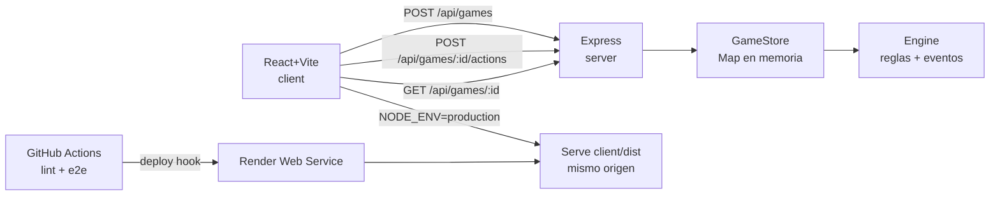

# Duelo de Cristales

Juego web por turnos para 2 jugadores (hot-seat): dos magos compiten en un tablero 10×10 recolectando cristales (maná + puntos) mientras invocan súbditos, lanzan hechizos y tratan de destruir el **Núcleo** (castillo) del rival antes del turno 30.

Proyecto final de React — tercer parcial.

## Stack

| Capa | Tecnología |
|---|---|
| Frontend | React 18 + Vite + TypeScript |
| Backend | Node.js + Express + TypeScript |
| Pruebas unitarias / propiedades | Jest + fast-check |
| Pruebas E2E | Playwright |
| CI/CD | GitHub Actions (lint • e2e • deploy) |
| Despliegue | Render |

## Requisitos previos

- **Node.js 22+**
- **npm 10+**

## Instalación y ejecución local

```bash
# 1) Instalar dependencias (client y server)
npm install --prefix duelo-de-cristales/client
npm install --prefix duelo-de-cristales/server

# 2) Levantar backend (API en http://localhost:3001)
npm run dev:server

# 3) En otra terminal, levantar frontend (Vite; proxy de /api a 3001)
npm run dev:client

# Abrir http://localhost:5173 (o el puerto que muestre Vite)
```

Comandos de calidad y pruebas (desde la raíz):

```bash
npm run lint    # ESLint (client + server)
npm run build   # type-check + build (client + server)
npm run test:e2e                       # Playwright E2E (levanta servidores)
npm run test --prefix duelo-de-cristales/client    # Vitest (cliente)
npm run test --prefix duelo-de-cristales/server    # Jest + fast-check (server)
```

## Arquitectura

```
┌──────────────┐  fetch /api/*   ┌──────────────────────────┐
│  React (Vite)│ ──────────────▶ │  Express + TypeScript    │
│  - Board     │   HTTP + JSON   │  - API REST (Rutas)      │
│  - Cell/HUD  │ ◀────────────── │  - GameStore (en memoria)│
│  - acciones  │    GameState    │  - Engine (árbitro)      │
└──────────────┘                 └──────────────────────────┘
        │                                │
        │ dev: proxy /api                │ single-service en prod:
        │ prod: Express sirve client/dist │ Render ()
        ▼                                ▼
   Jugadores (hot-seat)            Deploy hook → GitHub Actions
```



## API REST (resumen JSON)

| Método | Ruta | Cuerpo | Respuesta (200/2xx) |
|---|---|---|---|
| `GET` | `/api/health` | – | `{ "ok": true }` |
| `POST` | `/api/games` | `{ "player1", "player2" }` | `201 { "ok": true, "gameId", "state" }` |
| `GET` | `/api/games/:id` | – | `200 { "ok": true, "state" }` |
| `POST` | `/api/games/:id/actions` | `{ "playerId", "action", "target?" }` | `200 { "ok": true, "state" }` |
| `GET` | `/api/games/:id/history` | – | `200 { "ok": true, "history" }` |

`state` contiene el estado autoritativo completo: `board` (10×10), `players`, `units`, `projectiles`, `events`, `turn`/`turnNumber`, `winner`, `crystalDoubleActive`.

Ejemplo mínimo de una partida:

```bash
curl -X POST http://localhost:3001/api/games \
  -H 'Content-Type: application/json' \
  -d '{"player1":"Leo","player2":"Rival"}'
```

Documentación completa de la API (cuerpos de error, códigos HTTP y ejemplos): [docs/api.md](duelo-de-cristales/docs/api.md).

## Variables de entorno

| Variable | Uso |
|---|---|
| `PORT` | Puerto del servidor (Render la inyecta; default `3001`) |
| `NODE_ENV` | `production` → Express sirve `client/dist` |
| `BASE_URL` | URL base para E2E (default `http://localhost:3001`) |
| `PW_SKIP_SERVERS` | `1` para que Playwright no levante servidores en CI |
| `RENDER_DEPLOY_HOOK_URL` | Secret de GitHub Actions para el deploy hook |

## Despliegue

- Público (Render, free tier): **https://threeer-parcial-final-leonardo-carrillo.onrender.com**
- CI/CD (GitHub Actions): al hacer push a `main` corren 3 workflows — `lint`, `e2e` (15 specs E2E contra la app compilada) y `deploy` (si todo pasa, dispara el deploy hook de Render).
- Nota free tier: el servicio duerme tras ~15 min de inactividad; el primer request tarda 30–50 s (cold start). Awaken: abrir la URL unos segundos antes de la demo.

## Video de demostración

**Enlace:** *(pendiente de grabar)* — partida completa en navegador, requests JSON en DevTools, E2E en Chromium, 3 workflows verdes de GitHub Actions y URL pública de Render.

## Documentación

- [Introducción](duelo-de-cristales/docs/introduction.md)
- [Reglas del juego](duelo-de-cristales/docs/reglas.md)
- [API REST](duelo-de-cristales/docs/api.md)
- [Decisiones técnicas](duelo-de-cristales/docs/decisiones.md)
- [Investigación técnica](duelo-de-cristales/docs/investigacion.md)

## Autor

Leonardo Carrillo